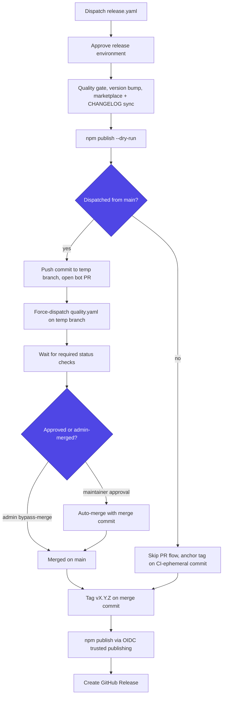

Maintainer runbook for cutting a release of `bmad-module-ultracode-goal`. The canonical release path is [`.github/workflows/release.yaml`](../../.github/workflows/release.yaml) — manual dispatch, OIDC trusted publishing, no token secrets.

## How a release works

Dispatching `release.yaml` from `main` runs, in order:

1. Quality gate (`npm test`) on the release runner.
2. Version bump (`npm version` — `alpha`/`beta`/`rc` prerelease or `patch`/`minor`/`major`).
3. Sync `.claude-plugin/marketplace.json` `.plugins[0].version` to the new version (atomic jq edit).
4. CHANGELOG update via `conventional-changelog-cli`, preamble restored to Keep-a-Changelog shape.
5. Pre-publish `npm publish --dry-run` (catches package validation failures before anything is pushed).
6. **PR-auto-merge flow**: the release commit is pushed to a temp branch `release/bot/vX.Y.Z-<run_id>`, a bot PR is opened against `main`, `quality.yaml` is force-dispatched against the temp branch (PR events from `GITHUB_TOKEN` do not fire workflows), the workflow waits for all required status checks, then for maintainer approval (or an admin bypass-merge), then auto-merges with a merge commit.
7. Tag `vX.Y.Z` anchored on the merge commit.
8. `npm publish` via OIDC trusted publishing (provenance auto-attached).
9. GitHub Release created from generated notes.

Dispatching from a non-`main` ref skips the PR flow: the tag anchors on the CI-ephemeral commit and `main` is not advanced. This is the expected path for prerelease cuts from feature branches.

How the dispatch ref forks the pipeline, and where the two paths rejoin to tag and publish:



## One-time setup

These must exist before the first `main`-dispatch release. Order matters.

### 1. Required-check contexts must exist

Branch-protection rulesets can only require status checks that have reported at least once. Open any PR (or dispatch `quality.yaml` manually) so these seven contexts exist:

```text
prettier
eslint
markdownlint
validate (ubuntu-latest)
validate (windows-latest)
python (ubuntu-latest)
python (windows-latest)
```

### 2. Main-branch ruleset

Create a ruleset on `main` requiring the seven contexts above, with `bypass_actors` = Admin RepositoryRole, `bypass_mode: pull_request`. Then record its id in the repo variable the workflow reads:

```bash
gh api /repos/armelhbobdad/bmad-module-ultracode-goal/rulesets --jq '.[] | {id, name}'
gh variable set RELEASE_RULESET_ID --body "<id>"
```

The wait-for-checks step fetches the required-context list from this ruleset at run time, so the workflow can never drift from branch protection. It fails fast with a setup hint if the variable is unset.

### 3. `release` GitHub Environment

Create an Environment named `release` with `armelhbobdad` as a required reviewer. `github-actions[bot]` cannot self-approve; every release run pauses for this approval before any step executes.

### 4. npm Trusted Publisher

On [npmjs.com](https://www.npmjs.com/) → package settings → Trusted Publisher, register:

- Repository: `armelhbobdad/bmad-module-ultracode-goal`
- Workflow filename: `release.yaml` (character-for-character — renaming the file breaks publishing)
- Environment: `release`

The workflow upgrades npm to ≥ 11.5.1 (the OIDC trusted-publishing floor) and pins `NPM_TOKEN: ""` on both publish steps so a stale runner-env token can never be picked up silently. Note: the very first publish of a brand-new package may need to be performed manually (`npm publish` with a granular token) before Trusted Publisher can be attached to the package — check current npm rules when cutting `0.1.0`.

### 5. Repo settings: auto-merge + Actions PR creation

```bash
gh api --method PATCH /repos/armelhbobdad/bmad-module-ultracode-goal -f allow_auto_merge=true
gh api --method PUT /repos/armelhbobdad/bmad-module-ultracode-goal/actions/permissions/workflow \
  -f default_workflow_permissions=read -F can_approve_pull_request_reviews=true
```

Without `allow_auto_merge`, `gh pr merge --auto` in the workflow fails. Without `can_approve_pull_request_reviews` ("Allow GitHub Actions to create and approve pull requests" in Settings → Actions → General — **off by default**), the `Open bot PR` step fails with `GraphQL: GitHub Actions is not permitted to create or approve pull requests`. The workflow-level `permissions: pull-requests: write` declaration is necessary but NOT sufficient — this repo-level toggle gates it independently.

### 6. Health-check labels

The health-check loop's `gh issue create` hard-fails on missing labels (only the per-fingerprint `fp-*` label is guarded with `|| true`). Pre-create the fixed set:

```bash
for L in "health-check:0E8A16" "workflow-improvement:1D76DB" "bug:D73A4A" "friction:FBCA04" "gap:C5DEF5" "duplicate:CFD3D7"; do
  gh label create "${L%%:*}" --repo armelhbobdad/bmad-module-ultracode-goal --color "${L##*:}" 2>/dev/null || true
done
```

## Version-coupling invariant

`package.json` `version` and `.claude-plugin/marketplace.json` `.plugins[0].version` must always be equal. The release workflow enforces this at release time (step 3); between releases, keep them equal by hand — `npm run test:install` asserts the coupling and fails the quality gate on drift.

## Cutting a release

1. Confirm `main` is green and the working tree state you want to ship is merged.
2. Actions → Release → Run workflow → choose the bump type. Prefer an `alpha` for the first cut after any pipeline change — it exercises the full path with a low-stakes version.
3. Approve the `release` environment run when prompted.
4. Approve (or admin-merge) the bot PR when checks are green.
5. After publish, dispatch `install-smoke.yaml` with the new version — it verifies `npx bmad-module-ultracode-goal@<version> --version` on ubuntu/windows/macos.

## Rollback playbook

npm unpublish is heavily restricted; prefer forward fixes.

- **Bad publish, caught quickly:** `npm deprecate bmad-module-ultracode-goal@X.Y.Z "broken — use X.Y.Z+1"`, then cut a patch release.
- **Bad prerelease tag:** point the dist-tag back: `npm dist-tag add bmad-module-ultracode-goal@<good> alpha`.
- **Bad git tag (not yet published):** delete the tag (`git push origin :refs/tags/vX.Y.Z`) and the bot PR/branch, then re-dispatch.
- **Workflow died mid-flow:** the PR (if opened) is left open by design for inspection. Close it, delete the temp branch, fix the cause, re-dispatch — the `run_id`-suffixed branch name prevents collisions on retry.
