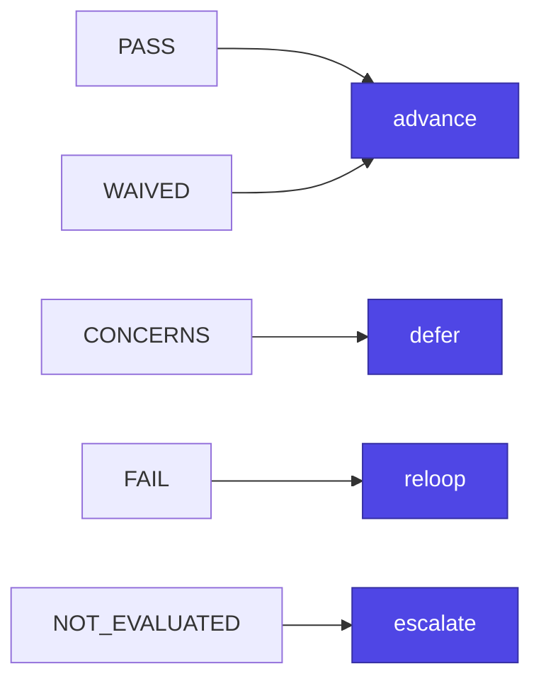

> **Status:** 2.x. The surfaces below are the public contract. Per [Semantic Versioning 2.0.0](https://semver.org/), a breaking change to any of them requires a MAJOR bump; everything marked `@internal` may change in any release. This document is what a consumer pins against.

This is the stability posture for `bmad-module-ultracode-goal` at `2.x`. It enumerates the surfaces a downstream consumer or automator may reasonably depend on, versus everything else, which is `@internal`.

## Public contract

The following surfaces are the public contract. Breaking one requires a MAJOR bump; see [SemVer note](#semver-note).

### CLI command surface

The installer CLI is invoked via `npx bmad-module-ultracode-goal <subcommand>`. Covered:

- **Subcommands**: `install`, `update`, `status`, `uninstall`. Renaming, removing, or changing the semantics of any subcommand is a contract change.
- **Options**: `-V` / `--version` (prints the installed package version) and `-h` / `--help` (top-level and per-subcommand).

### The `[workflow]` customize.toml keys

The keys in the shipped `[workflow]` block of `customize.toml` (including `persistent_facts`, `tea_config_path`, `trace_output_dir`, `implementation_artifacts`, `deferred_work_path`, `epic_branch_prefix`, `protected_branches`, `max_turns_per_story`, `story_token_budget` (**deprecated, no-op**), `parallel_max_concurrency` (**deprecated, no-op**), `allowlist_commands`, `on_epic_complete`, `on_escalation`, `cross_session_recall`, and `graphify_integration`) are the supported override surface. Teams and users override them in `_bmad/custom/ultracode-goal.toml` (and `.user.toml`) with base → team → user resolution (scalars override, tables deep-merge, arrays append). Renaming or removing a key, or changing how it resolves, is a contract change. See [architecture](../architecture.md).

`story_token_budget` is **deprecated** as of the deprecation note in `CHANGELOG.md`: it is still shipped, still accepted, and still resolves, so existing overrides keep working and nothing errors. It is a no-op; no layer reads it any more. The runaway bound is turns only, via `max_turns_per_story`. The key stays enumerated here (and stays in `customize.toml`) precisely because removing it would be the contract break this section forbids.

`parallel_max_concurrency` is **deprecated** on the same terms, as of the retirement of the experimental `--parallel` fan-out: still shipped, still accepted, still resolves, read by nothing. The `--parallel` flag itself is likewise still accepted by the skill and ignored (the run logs one note and executes the sequential spine), so an operator's old invocation keeps working.

### The headless five-key JSON emit shape

Every headless (`-H`) exit point emits one object with exactly these five keys, always present, `null` when an artifact was not produced, plus a conditional sixth, `reason`, carrying a one-line cause only when blocked. A **complete** emit omits `reason` entirely; it is not present-and-`null`, so read it only when `status` is `blocked`:

```json
{"status": "complete|blocked",
 "skill": "ultracode-goal",
 "decision_log": "<path>",
 "report": "<path or null>",
 "deferred_work": "<path or null>",
 "reason": "<one line, present only when blocked; omitted on a complete emit>"}
```

An automator parses this one schema regardless of where the run stopped. Changing a key name, adding or removing a key, changing the `null`-when-absent guarantee, or making `reason` present on a complete emit is a contract change.

### The headless result file

A headless run writes that same object to `{workflow.implementation_artifacts}/run-result.json`, byte-identical to what it emitted on stdout, so an automator reads a pinned file path instead of scraping a transcript. Covered:

- **The path**: the basename `run-result.json` directly inside the resolved `{workflow.implementation_artifacts}`, with no run-id suffix and no subdirectory.
- **The contents**: the headless five-key emit shape above, unchanged.

- **The guarantee**: once a headless run resolves `{workflow.implementation_artifacts}` it clears any prior `run-result.json`, before any stage work. From that point on the file's presence means **this** run reached a terminal. The guarantee is scoped to that moment, so a consumer should still prefer a parseable stdout envelope when the file is absent.

Four documented exceptions, none of which is a contract break: a block that fires **before** `{workflow.implementation_artifacts}` resolves (the "not a BMAD project" stop) neither writes nor clears, so it leaves the stdout envelope as its sole output and is the one case where a prior run's file can survive; a terminal whose best-effort write failed leaves no file while still printing its envelope; a headless run that has not yet reached a terminal (still running, crashed, or killed) has no file, because startup cleared any prior one; and an **attended** run writes no file at all and clears none. The file is overwrite-in-place, so it carries no cross-run history.

### The skill name and invocation phrases

The skill name `ultracode-goal` and its documented invocation phrases ("run an epic autonomously", "execute this epic", "ultracode goal", "autonomously deliver the epic") are part of the contract. Removing or renaming the skill, or dropping a documented trigger phrase, is a contract change.

### gate_eval.py CLI and verdict vocabulary

`scripts/gate_eval.py` is the deterministic completion authority. Covered:

- **CLI flags**: `--trace-output` (required), `--profile` (`light` | `production`, required), `--story`, `--nfr`, `--test-review` (production only), `--epic-level`, `--rollup` and `--sprint-status` (roll-up only: `--rollup` requires `--epic-level`, `--story <epic id>` and `--sprint-status`, and `--sprint-status` is rejected without `--rollup`; every roll-up refusal resolves to `gate_status: NOT_EVALUATED` -> `escalate`, never to a silent narrower answer).
- **The production signals are required, not optional, on a per-story gate.** Under `--profile production` an omitted `--nfr` or `--test-review` is a *failing* signal, exactly as a supplied-but-missing path already was. `--epic-level` is the one sanctioned omission: it declares the epic roll-up, where TEA writes no aggregate to AND, and it cannot be combined with either path (doing so is an invocation error, exit 2). Under `--profile light` the flag is a no-op.
- **Verdict vocabulary**: the `verdict` values `advance` / `defer` / `reloop` / `escalate`, and the `gate_status` values `PASS` / `CONCERNS` / `FAIL` / `WAIVED` / `NOT_EVALUATED`, plus the mapping between them. See the [gate model](../gate-model.md).
- **`--story` fail-closed resolution**: when `--story` matches no artifact in a trace dir whose reports or gate-decision files are named per story, the result is `NOT_EVALUATED` (so, `escalate`), never a fallback to another story's gate. A trace dir whose candidates are all generically named (`trace.md`, `gate-decision.json`) still resolves unscoped. Which file the resolver picks, and how it decides that a name carries a story id, are internal.

The contractual mapping each `gate_status` resolves to:



The printed JSON object's key set (`verdict`, `gate_status`, `p0_status`, `p1_status`, `overall_status`, `nfr_status`, `review_score`, `epic_level`, `reasons`) is the consumable shape; the human-readable `reasons` strings are not contractual wording. `epic_level` is how a consumer tells an `advance` that ANDed both production signals from one that skipped them by declaration: `nfr_status: null` alone cannot say which, and the distinction is not readable from `reasons` precisely because that wording is not contractual.

## @internal: not covered

Everything not enumerated above is `@internal` and may change in any release, major or minor, without a deprecation note. Do not pin against:

- **Installer library internals**: the implementation behind the CLI subcommands; what is covered is the observable subcommand surface, not how the files get placed.
- **Reference file structure**: the `references/*.md` stage files' internal structure, step ordering, prose, and section headings. The stage *names* are referenced by the health-check fingerprint (see below) but the file contents are an authoring surface.
- **Script internals**: the internal functions, regexes, and intermediate behavior of `preflight_check.py`, `gate_eval.py`, `health_check_fp.py`, and the hook scripts. The covered surface is `gate_eval.py`'s CLI and verdict vocabulary above; everything else (the `preflight_check.py` JSON shape, the fingerprint tuple format, the hook env-var names) is internal and may change.
- **The retired `--parallel` workflow**: the experimental fan-out (`assets/execute-epic.workflow.js`, its `/ultracode-goal-execute` registration, args binding and return shape) was explicitly excluded from this contract while it shipped, and has been removed. The `--parallel` flag is still accepted and ignored, and `parallel_max_concurrency` is deprecated, still resolving, no-op — the `story_token_budget` treatment (see [Public contract](#public-contract)).
- **`_bmad-output/` artifact layout**, with one exception: run folders, the decision log, `run-report.md`, `run-status.json`, the deferred-work ledger, and the improvement queue are run outputs, not a downstream-consumable schema. **`run-result.json` is the exception and is covered** (see [the headless result file](#the-headless-result-file)); it is the one artifact in that tree an automator may pin against. The headless emit shape (covered above) is the supported way to locate the rest of these paths programmatically.

## SemVer note

**A breaking change to any surface in [Public contract](#public-contract) requires a MAJOR bump.** That is the whole rule, and it is deliberately stricter than "we try": this module's value is that a machine-checked contract means what it says, so the versioning of the contract has to as well.

What counts as breaking, stated so it is not re-litigated per release:

- Removing or renaming an enumerated CLI flag, subcommand, config key, or JSON key.
- **Changing the verdict an unchanged, previously-documented invocation returns.** This is the one that bites, and it bit at 2.0.0: `gate_eval.py --profile production` with neither signal flag was the documented epic-level invocation and returned `advance`; it now returns `reloop` unless `--epic-level` is passed. That the old answer was unearned did not make the change non-breaking — a consumer's pipeline still changed behaviour on an upgrade they did not ask for.
- Adding a key to the printed verdict JSON or the headless envelope, for a consumer validating the shape strictly.

What does not:

- Fixing a resolver so it returns the *right* artifact rather than a neighbour's, where the documented invocation and its vocabulary are unchanged.
- Anything behind `@internal`, including which file a resolver picks and how it decides a name carries a story id.
- Prose in `references/*.md`, which is an authoring surface.

**Deprecation.** The two surfaces an automator is most likely to encode against — the **headless five-key JSON emit shape** and the **`[workflow]` customize.toml keys** — get a deprecation note in `CHANGELOG.md` at least one minor before changing, and the key stays shipped and accepted meanwhile. `story_token_budget` is the worked example: deprecated, still resolving, no-op.
