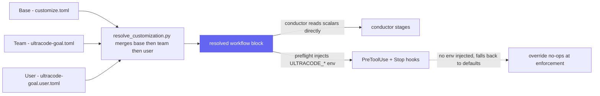

UltraCode Goal is a conductor. It orchestrates the installed BMAD epic toolbox and the TEA gates, composing Claude Code primitives (`/goal`, Auto Mode, Auto Memory, hooks, git/worktree isolation) and replaces none of them. This page covers the conductor model, the three enforcement layers in depth, the file layout, customization resolution, and why the hooks live where they do.

## The conductor model

The skill owns no implementation logic of its own for building features or running tests. What it owns is the *order*, the *gates*, and the *enforcement*. It delegates:

- **Epic toolbox**: `bmad-sprint-planning`, `bmad-create-story`, `bmad-check-implementation-readiness`, `bmad-dev-story`, `bmad-code-review`, `bmad-correct-course`, `bmad-sprint-status`, `bmad-retrospective`.
- **TEA gates**: `bmad-testarch-framework`, `-ci`, `-test-design`, `-atdd`, `-automate`, `-test-review`, `-nfr`, `-trace`.
- **Claude Code primitives**: the `/goal` loop drives execution; Auto Mode and ultracode session effort make the unattended run possible; Auto Memory carries learnings forward; hooks enforce invariants; git branches and worktrees provide isolation and rollback.

Because it is a conductor, the truth of "is this done" lives in the artifacts its delegates produce, not in the conductor's own reasoning. That is the whole design: the model arranges the work, but a script reads the verdict.

## The three enforcement layers

These are the module's non-negotiables. Each exists because the documented mechanics make the intuitive shortcut wrong (see [why](why-ultracode-goal.md)).

### 1. Deterministic gate truth

`scripts/gate_eval.py` reads TEA's `gate-decision.json` and maps its gate status to a routing verdict (`PASS`/`WAIVED` → advance, `CONCERNS` → defer, `FAIL` → reloop, `NOT_EVALUATED` → escalate). It never re-derives TEA's thresholds and never reads the transcript. The `/goal` evaluator that drives execution can only see what the run surfaces, it cannot open the gate file, so it is structurally incapable of being the completion authority. The script is. In production, two extra signals can only downgrade an `advance`, never lift a lower verdict. See the [gate model](gate-model.md) for the full mapping diagram, thresholds, and the fail-closed contract.

### 2. Hooks as invariants

Two invariants must hold for every commit, and neither can live in memory, which is context the model may or may not weigh:

- **`scripts/hooks/guard_pretooluse.py`** (PreToolUse): inspects each `git commit`/`git push`. It denies the command on a protected branch, and denies a `git commit` when no tests-ran marker (`<impl-artifacts>/.tests-ran-<story_id>`) exists for the current story. It returns a `deny` decision in the hook JSON and also exits 2 with the reason on stderr so older clients that ignore the JSON still block.
- **`scripts/hooks/budget_stop.py`** (Stop): counts turns and accumulated tokens for the current story against `max_turns_per_story` / `story_token_budget`. On overrun it writes an escalation marker and surfaces a message, then **lets the stop proceed**. Its documented limitation: a Stop hook fires only when Claude is already trying to stop, so it cannot interrupt a `/goal` condition mid-turn. The in-condition "stop after N turns" clause and the gate's re-loop budget are the real bounds; this hook is the third, defensive layer.

Both hooks read their config from env first (so the conductor injects per-run values) and fall back to hardcoded defaults (`main`/`master`, `25`, `1_500_000`, `ultracode/epic-`). Because of that fallback, a `customize.toml` override **silently no-ops at the enforcement layer** unless the conductor passes it through the hook env, so preflight injects `ULTRACODE_PROTECTED_BRANCHES`, `ULTRACODE_IMPL_ARTIFACTS`, `ULTRACODE_MAX_TURNS`, `ULTRACODE_TOKEN_BUDGET`, and `ULTRACODE_EPIC_BRANCH_PREFIX`.

### 3. Budget enforcement

A runaway story is bounded by three layers in order of authority: the **in-condition** "…or stop after N turns" clause inside the `/goal` condition (the real in-loop bound), the **gate re-loop budget** (a `reloop` that would exceed `max_turns_per_story` or `story_token_budget` becomes `escalate`), and the **Stop hook** as the defensive backstop described above. Rollback is git, not `/rewind` (an Epic branch off a protected branch, one commit per green story, worktree isolation under `--parallel`) because `/rewind` checkpoints miss the Bash-driven changes that make up the run.

## File layout

The skill routes from a thin entry point down to just-in-time stage files, deterministic scripts, and an experimental asset:

```
skills/ultracode-goal/
├── SKILL.md                       # Entry point: overview, conventions, run modes,
│                                  #   non-negotiables, the 6-stage table, headless contract
├── customize.toml                 # Config base layer (the [workflow] block)
├── references/                    # Loaded just-in-time
│   ├── ingest-and-scope.md        #   Stage 1
│   ├── preflight.md               #   Stage 2 (the autonomy gate)
│   ├── define-done.md             #   Stage 3
│   ├── execute.md                 #   Stage 4
│   ├── gate.md                    #   Stage 5
│   ├── finalize.md                #   Stage 6
│   └── health-check.md            #   Finalize self-improvement reflection
├── scripts/                       # Deterministic truth (run via `uv`)
│   ├── preflight_check.py         #   mechanical preflight facts + blocker budget
│   ├── gate_eval.py               #   gate status -> verdict (the completion authority)
│   ├── formalize_check.py         #   readiness kernel behind the /ucg-formalize gate
│   ├── headless_envelope.py       #   the one five-key headless-envelope adapter
│   ├── health_check_fp.py         #   health-check fingerprint + seen-cache plumbing
│   ├── mem_observation.py         #   Cross-Session Recall write path (build/spill/drain)
│   ├── mem_recall.py              #   Cross-Session Recall read path (latch + filter)
│   ├── merge_config.py            #   install-time config merge into shared _bmad
│   ├── merge_customization.py     #   install-time UCG-awareness fragment merge
│   ├── merge_help_csv.py          #   install-time help-CSV merge
│   ├── lib/mem_common.py          #   shared Cross-Session Recall primitives
│   └── hooks/
│       ├── guard_pretooluse.py    #   commit invariants (PreToolUse)
│       └── budget_stop.py         #   turn/token budget (Stop)
├── skills/
│   └── ucg-formalize/             # Standalone readiness gate (installs everywhere)
└── assets/
    ├── execute-epic.workflow.js   # EXPERIMENTAL --parallel worktree fan-out
    ├── module.yaml · module-setup.md · module-help.csv   # install metadata
    └── ucg-awareness/             # shift-left planning customization fragments
```

`SKILL.md` carries the routing and the contract; the `references/*.md` files carry each stage's procedure and testable routing conditions; the `scripts/*.py` files carry the deterministic facts the model cannot fudge (the gate, preflight, readiness kernel, hooks, and the install-time/recall plumbing); the `skills/ucg-formalize/` subskill is the standalone readiness gate; and the `assets/` hold the experimental `--parallel` workflow plus install metadata and the planning-customization fragments. See [how it works](how-it-works.md) for the stages and [parallel mode](parallel-mode.md) for the workflow asset.

## Customization resolution

Configuration resolves in three layers, base → team → user, via `resolve_customization.py`:

1. **Base**: `customize.toml` in the skill root (the shipped `[workflow]` block).
2. **Team**: `{project-root}/_bmad/custom/ultracode-goal.toml`.
3. **User**: `{project-root}/_bmad/custom/ultracode-goal.user.toml`.

Merge semantics: **scalars override**, **tables deep-merge**, **arrays append**. At activation the skill runs `resolve_customization.py --skill {skill-root} --key workflow`; if that fails, it resolves the three files itself in the same order. The shipped base layer defines the run's knobs: the TEA/artifact paths (`tea_config_path`, `trace_output_dir`, `implementation_artifacts`, `deferred_work_path`), the git guardrails (`epic_branch_prefix`, `protected_branches`), the budgets (`max_turns_per_story`, `story_token_budget`), the experimental `parallel_max_concurrency`, the `allowlist_commands`, and the `on_epic_complete` hook. Teams and users override without editing the shipped file. Remember that a budget or branch override only reaches the *enforcement* layer because preflight threads it into the hook env (see layer 2 above).

The three TOML layers merge once, but a branch or budget value then travels two ways: the conductor reads it directly, while the hooks only see it if preflight re-injects it as env:



## Why the hooks live in settings.local.json (decision D6)

The PreToolUse and Stop hooks are auto-merged into `{project-root}/.claude/settings.local.json` (machine-local, gitignored, honored after the workspace trust dialog), not into a committed settings file or memory. The reasoning: these hooks are **enforcement, not context**. A committed hook would impose this module's commit guard on every contributor and every unrelated session in the repo; a hook in memory would not block a commit at all. The machine-local file scopes enforcement to the machine actually running the unattended Epic, and the gitignore keeps it out of shared history. The skill re-merges them every run (idempotently) and asserts they are active before the run goes unattended; it does not assume a prior run left them in place. Because the file is machine-local and executes on your machine, review what is merged; see [SECURITY.md](../SECURITY.md).
