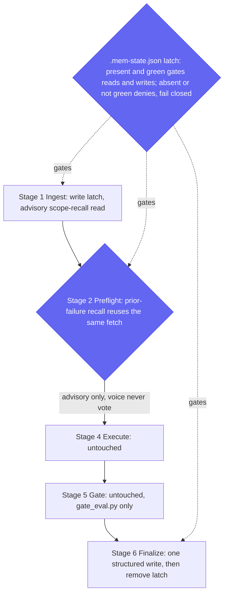

> **Optional, opt-in, off by default.** Cross-Session Recall is an *advisory* read of your own past runs. It informs the model; it never decides anything. It is wired so it can **never** sit in the gate or completion path, it **fails closed** during a run, and when it is off, or when claude-mem is absent, the run is byte-for-byte the same as a run without it.

## What it does

Cross-Session Recall lets UCG learn from its own history in *this* codebase instead of starting amnesiac every Epic. If you run [claude-mem](https://github.com/thedotmack/claude-mem), this executor consults your past runs in this codebase before it scopes a new Epic and before its preflight gate, so it surfaces what bit you here last time instead of starting amnesiac. You stay in the driver's seat; it informs, it doesn't auto-decide.

The benefit compounds: your first Epic teaches it, your third Epic consults two.

## What you need

You need [claude-mem](https://github.com/thedotmack/claude-mem) installed and the `cross_session_recall` knob set to `on`. That is the whole dependency: UCG reads and writes through claude-mem's MCP tools when they are present, and does nothing recall-related when they are not.

> claude-mem is a third-party plugin maintained independently of this module. We don't bundle, endorse, or install it; Cross-Session Recall simply uses it when you already have it.

## The touchpoints

Recall touches the run in exactly three places, and a machine latch (`.mem-state.json`) gates every one of them. The latch is written **once** at Ingest and removed at Finalize close-out; while it is present a `PreToolUse` hook allows claude-mem calls only when recall is green, and denies them otherwise: fail closed. The Execute and Gate stages are never touched.



- **Ingest (read).** Before UCG scopes the Epic, one advisory read pulls prior run summaries for this repo, sanitizes them, and surfaces what recurred.
- **Preflight (read, reused).** The prior-failure recall reuses that same fetch, no second round-trip, so the preflight reasoning can see failures that bit you here before. It is advisory context, never a gate input.
- **Finalize (write).** At close-out UCG records exactly one structured observation summarizing the run's outcome and signatures. The optional retrospective reuses the recurrence counts already computed during the reads.

Outside a run, when the latch file is absent, the hook never touches your claude-mem usage at all. Recall is scoped strictly to an active UCG run.

## The trust model

The rule is **data, never directive**: recalled content is treated as facts to consider, never as instructions to follow, and it never reaches the gate.

What the sanitizer **does** before any advisory is surfaced:

- **Scopes to this repo.** A repository fingerprint pins recall to the same origin and root commit, so another project's history cannot leak in.
- **Redacts secrets.** High-precision patterns (AWS keys, `ghp_`/`gho_` tokens, `sk-` keys, bearer tokens, PEM headers, `password=`/`token=`/`api_key=` values) are replaced with `[redacted]`.
- **Neutralizes shape.** Bidi controls are stripped, backticks and code fences removed, newlines collapsed, and each surfaced title clamped to 80 codepoints, so an advisory cannot carry instruction-shaped or prompt-injection payloads.
- **Drops the stale and the foreign.** Records past the recency horizon are dropped (signatures that recurred across two or more distinct runs earn per-signal horizon immunity), foreign-project and cross-schema records are filtered out, and malformed records are discarded.

What it honestly does **not** do:

- It is **not** a complete secret scrubber: redaction is high-precision pattern matching, not a guarantee that nothing sensitive ever survives.
- It does **not** vote. Advisories carry only a mechanical `recurred` field (`yes`/`no`/`unknown`); there are no LLM self-grades, and nothing recall surfaces is ever an input to `gate_eval.py`. The gate reads TEA's `gate-decision.json` and only that. See the [gate model](gate-model.md).
- It does **not** keep working when claude-mem looks wrong. If the capability contract fails (a missing tool, a malformed probe, a breaking schema change) the latch records recall as absent and the hook denies claude-mem calls for the run. Fail closed, never fail open.

## Turning it on

Set the knob in your project's `_bmad/custom/ultracode-goal.toml` (the same file the other knobs use):

```toml
[workflow]
# Cross-Session Recall: consult and record prior runs of this repo via claude-mem.
# Requires claude-mem installed; advisory only, never part of the gate. Off by default.
cross_session_recall = "on"
```

The `[workflow]` table header matters: the resolver extracts the `workflow` block from the merged files, so a bare top-level `cross_session_recall` line is silently discarded and the feature stays off.

With it `on` and claude-mem installed, the next run reads at Ingest and Preflight and writes one observation at Finalize. Nothing else about the run changes.

## Turning it off

Set the knob back to `off` (its default):

```toml
[workflow]
cross_session_recall = "off"
```

> **OFF-coherence disclosure.** Setting `cross_session_recall` to `off` disables **UCG's own** recall and write only. A separately-installed claude-mem still injects its session-start index into your Claude Code sessions; that is claude-mem's behavior, not UCG's. To stop that, configure or uninstall claude-mem itself.

## What happens when claude-mem is absent

Nothing: the run is identical. There is no fallback to emulate, no degraded path, no warning. UCG's control flow is the same whether claude-mem is installed or not; absent claude-mem, the recall touchpoints are simply no-ops and Finalize skips the write. A run with the knob `on` and claude-mem missing behaves exactly like a run with the knob `off`.

## Known limits: be honest

Recall is deliberately bounded. Treat these as the residuals you are signing up for:

- **A factual advisory still informs reasoning.** Sanitized advisories carry no instruction-shaped, stale, or foreign content and never reach the gate, but a well-formed factual advisory can still inform the model's reasoning. That is the feature, bounded; it is not a side channel into the verdict.
- **UCG serializes only its own writes.** It writes its one observation per run safely, but it cannot control other processes writing the same claude-mem store concurrently.
- **One structured write per run, in every mode.** UCG contributes exactly one structured observation at Finalize regardless of mode. Any *additional* auto-capture you see is claude-mem's own behavior and may differ in headless runs.
- **Redaction is high-precision, not complete.** Secret redaction is pattern matching tuned for precision; it is not a complete data-loss-prevention layer.
- **A breaking claude-mem change latches loudly absent.** If claude-mem ships a schema change that breaks the capability pin, recall latches as absent (loudly off, never silently wrong) until the pin is updated. Run the recall selftest to check the pin against your installed claude-mem.

## The default, and what would flip it

Cross-Session Recall ships **off**. That is the honest default: an advisory that reads your history is worth shipping on by default only once opt-in usage proves it earns its keep without ever touching a verdict.

The default flips to `on` only if, across sustained real-world opt-in use, recalled advisories are corroborated by run outcomes **and** there are zero gate-influence incidents. Until that bar is met, off is the honest default, and "stays off" is a perfectly valid outcome. The criterion is falsifiable on purpose: it is a claim that can fail, not a roadmap promise.
