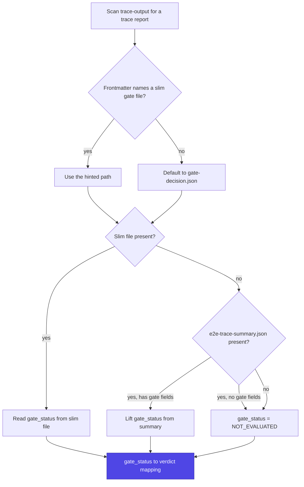
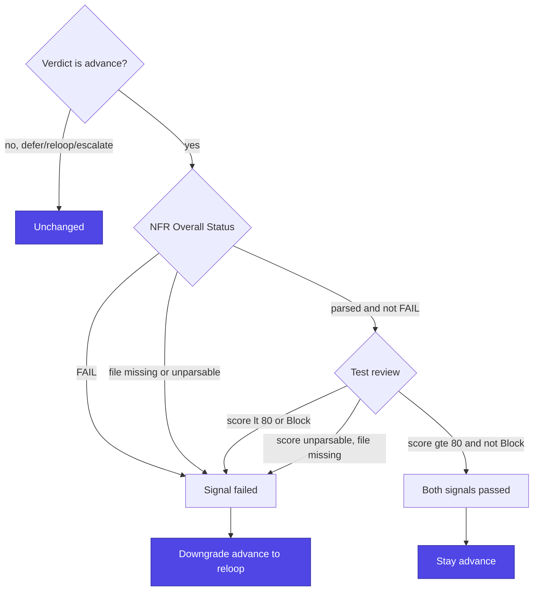

Completion in UltraCode Goal is decided by a deterministic artifact read, not by judgment. `scripts/gate_eval.py` reads TEA's `gate-decision.json` and returns a routing verdict the skill executes. This page documents the verdict mapping, the production AND, the thresholds, the fail-closed contract, and why the `/goal` evaluator alone is insufficient — all traced to [`../skills/ultracode-goal/scripts/gate_eval.py`](../skills/ultracode-goal/scripts/gate_eval.py).

## What the gate reads

The script resolves the gate artifact from the trace output directory:

1. It looks for a trace-report markdown whose frontmatter records the slim gate file (keys `gateDecisionFile` / `gateDecisionPath` / `gate_decision_path`), defaulting to `<trace-output>/gate-decision.json`.
2. If that slim file is absent, it falls back to the always-written `e2e-trace-summary.json` and lifts the gate fields from it. **The slim file's absence is normal, not a failure** — TEA only writes it when the run is gate-eligible and the decision is PASS/CONCERNS/FAIL/WAIVED.
3. If neither file is present, or the run carries no gate fields, `gate_status` is `NOT_EVALUATED`.

The script never re-derives TEA's thresholds; it reads `gate_status` as given by the trace workflow.

How the script resolves an artifact into a `gate_status`:



## Verdict mapping

The gate status maps to a verdict (`GATE_VERDICT` in the script):

| `gate_status` | verdict | the skill does |
|---------------|---------|----------------|
| `PASS` | `advance` | story passes; move to the next story |
| `WAIVED` | `advance` | story passes; move to the next story |
| `CONCERNS` | `defer` | append non-blocking items to the ledger, then advance anyway |
| `FAIL` | `reloop` | run `bmad-correct-course`, re-run the story within budget |
| `NOT_EVALUATED` | `escalate` | stop — the gate could not be read |

Any unrecognized status escalates (the script's `GATE_VERDICT.get(gate_status, "escalate")` default), with a `reasons` entry noting it.

## The production AND

Under `--profile production`, an otherwise-`advance` verdict is additionally ANDed against two TEA signals, and any failure downgrades it to `reloop`. The downgrade floor is `reloop` — a `defer`/`reloop`/`escalate` is unchanged; only an `advance` moves:

- **NFR** (`nfr-assessment.md`): the audit's Overall Status must not be `FAIL`.
- **Test review** (`test-review.md`): the Quality Score must be `>= 80` **and** the Recommendation must not be `Block`.

How the AND folds the two signals in, with every unreadable path counting as a failure:



Under `--profile light` none of this applies — the trace gate is the whole decision.

## The thresholds

The P0/P1/overall percentage thresholds — **P0 = 100%, P1 >= 90%, overall >= 80%** — are decided **upstream by the TEA trace workflow** and written into the gate artifact; `gate_eval.py` reads the resulting `gate_status`, `p0_status`, `p1_status`, and `overall_status` rather than recomputing the percentages. The script's own production AND adds the two coarser signals above (NFR != FAIL, review score >= 80 and recommendation != Block). Do not restate or recompute the TEA percentages elsewhere — they are TEA-owned, and the test-design stage's job is only to assign the P0–P3 priorities honestly so those upstream thresholds key off real priorities.

## Fail-closed contract

The production AND is deliberately fail-closed (see the `apply_production_and` docstring in the script): a missing `nfr-assessment.md` or `test-review.md`, or a field the scanners cannot parse, is treated as a **failing** signal — not a neutral or absent one. So if TEA's prose format drifts and the Overall Status or Quality Score cannot be read, an otherwise-`advance` degrades to a conservative `reloop` rather than a silent false-advance. The direction is intentional: the module would rather re-loop a green story than advance a story whose evidence it could not actually read. Likewise, a missing or corrupt gate artifact yields `NOT_EVALUATED` → `escalate` — the gate is never assumed green.

This is reinforced by the routing invariant in Stage 5: **a P0/critical FAIL never defers.** Only non-gate-blocking work (CONCERNS, non-critical findings, parked decisions) reaches the deferred-work ledger; a FAIL or a P0/critical finding re-loops within budget or escalates.

## Output shape

The script prints one JSON object (`evaluate()` in the script):

```json
{
  "verdict": "advance|defer|reloop|escalate",
  "gate_status": "PASS|CONCERNS|FAIL|WAIVED|NOT_EVALUATED",
  "p0_status": "...",
  "p1_status": "...",
  "overall_status": "...",
  "nfr_status": "...",
  "review_score": 0,
  "reasons": ["..."]
}
```

### Example — a clean production advance

A story whose slim gate file reads `PASS`, with an NFR audit of `PASS` and a test review scoring 92 with an Approve recommendation, produces:

```json
{
  "verdict": "advance",
  "gate_status": "PASS",
  "p0_status": "PASS",
  "p1_status": "PASS",
  "overall_status": "PASS",
  "nfr_status": "PASS",
  "review_score": 92,
  "reasons": [
    "gate read from gate-decision.json",
    "gate_status PASS -> advance"
  ]
}
```

### Example — a production downgrade

The same `PASS` gate, but with a test review scoring 74, downgrades to `reloop` — the gate passed, but a production signal failed:

```json
{
  "verdict": "reloop",
  "gate_status": "PASS",
  "p0_status": "PASS",
  "p1_status": "PASS",
  "overall_status": "PASS",
  "nfr_status": "PASS",
  "review_score": 74,
  "reasons": [
    "gate read from gate-decision.json",
    "gate_status PASS -> advance",
    "test-review score 74 < 80",
    "production signal failed; advance downgraded to reloop"
  ]
}
```

## Why the `/goal` evaluator alone is insufficient

The `/goal` loop that drives Execute ends with an evaluator confirming the success condition — but that evaluator only sees the transcript. It cannot open `gate-decision.json`. So it can confirm "the tests I was shown printed green" but not "TEA's deterministic gate read PASS against the traceability matrix and the NFR thresholds." Letting it be the completion authority would let the run grade itself from its own notes. `gate_eval.py` reads the file the model cannot author, which is exactly why it — and not the transcript evaluator — decides. See [why](why-ultracode-goal.md) and the routing detail in [`references/gate.md`](../skills/ultracode-goal/references/gate.md).
