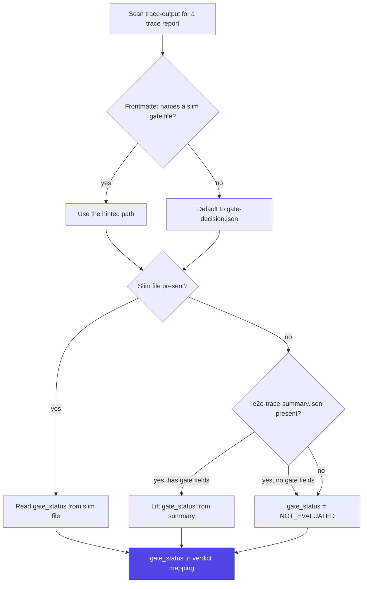
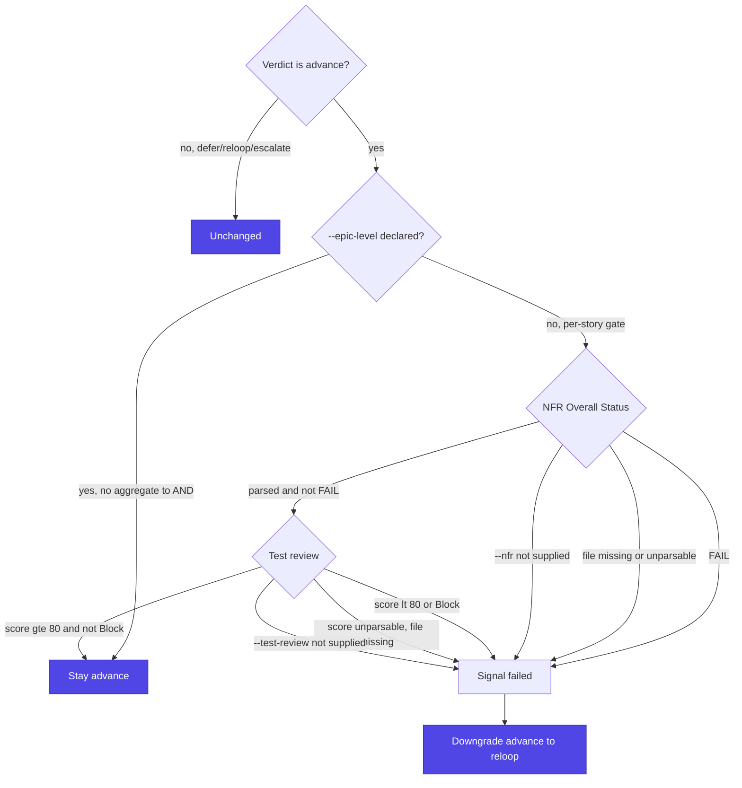

Completion in UltraCode Goal is decided by a deterministic artifact read, not by judgment. `scripts/gate_eval.py` reads TEA's `gate-decision.json` and returns a routing verdict the skill executes. This page documents the verdict mapping, the production AND, the thresholds, the fail-closed contract, and why the `/goal` evaluator alone is insufficient, all traced to [`../skills/ultracode-goal/scripts/gate_eval.py`](https://github.com/armelhbobdad/bmad-module-ultracode-goal/blob/main/skills/ultracode-goal/scripts/gate_eval.py).

## What the gate reads

The script resolves the gate artifact from the trace output directory:

1. It looks for a trace-report markdown whose frontmatter records the slim gate file (keys `gateDecisionFile` / `gateDecisionPath` / `gate_decision_path`), defaulting to `<trace-output>/gate-decision.json`.
2. If that slim file is absent, it falls back to the always-written `e2e-trace-summary.json` and lifts the gate fields from it. **The slim file's absence is normal, not a failure**: TEA only writes it when the run is gate-eligible and the decision is PASS/CONCERNS/FAIL/WAIVED.
3. If neither file is present, or the run carries no gate fields, `gate_status` is `NOT_EVALUATED`.

**`--story` scopes that resolution, and fails closed when it matches nothing.** Because one run gates many stories, the trace directory usually names its artifacts per story (`trace-2-1.md`, `gate-decision-4.json`). Passing `--story <id>` selects that story's artifacts. If the directory is named per story and the id matches none of them, the script does **not** fall back to an unscoped read: it returns `NOT_EVALUATED` with a reason naming the absent story, which routes to `escalate`. That matters because the fallback used to fire, so a story that produced no trace artifacts at all silently resolved a *neighbouring* story's decision and could report `PASS` / `advance` having been evaluated by nothing. The documented single-story fallback is untouched: a directory whose candidates are all generically named (`trace.md`, `gate-decision.json`) still resolves unscoped, so a single-story trace directory behaves exactly as it always did. The Epic-level gate is not that case: it passes the epic's own id via `--story` and matches it against trailing name components, so epic `4` resolves `gate-decision-4.json` and never its child story `4-1`, and an epic with no artifact of its own escalates rather than borrowing one.

The script never re-derives TEA's thresholds; it reads `gate_status` as given by the trace workflow.

How the script resolves an artifact into a `gate_status`:


```mermaid
flowchart TD
    A["Scan trace-output for a trace report"] --> B{"Frontmatter names a slim gate file?"}
    B -->|"yes"| C["Use the hinted path"]
    B -->|"no"| D["Default to gate-decision.json"]
    C --> E{"Slim file present?"}
    D --> E
    E -->|"yes"| F["Read gate_status from slim file"]
    E -->|"no"| G{"e2e-trace-summary.json present?"}
    G -->|"yes, has gate fields"| H["Lift gate_status from summary"]
    G -->|"yes, no gate fields"| I["gate_status = NOT_EVALUATED"]
    G -->|"no"| I
    F --> Z["gate_status to verdict mapping"]
    H --> Z
    I --> Z
    classDef verdict fill:#4F46E5,stroke:#3730A3,color:#fff
    class Z verdict
```

## Verdict mapping

The gate status maps to a verdict (`GATE_VERDICT` in the script):

| `gate_status` | verdict | the skill does |
|---------------|---------|----------------|
| `PASS` | `advance` | story passes; move to the next story |
| `WAIVED` | `advance` | story passes; move to the next story |
| `CONCERNS` | `defer` | append non-blocking items to the ledger, then advance anyway |
| `FAIL` | `reloop` | run `bmad-correct-course`, re-run the story within budget |
| `NOT_EVALUATED` | `escalate` | stop: the gate could not be read |

Any unrecognized status escalates (the script's `GATE_VERDICT.get(gate_status, "escalate")` default), with a `reasons` entry noting it.

## The production AND

Under `--profile production`, an otherwise-`advance` verdict is additionally ANDed against two TEA signals, and any failure downgrades it to `reloop`. The downgrade floor is `reloop`. A `defer`/`reloop`/`escalate` is unchanged; only an `advance` moves:

- **NFR** (`nfr-assessment.md`): the audit's Overall Status must not be `FAIL`.
- **Test review** (`test-review.md`): the Quality Score must be `>= 80` **and** the Recommendation must not be `Block`.

**Both paths are required, and an omitted flag is a failure too.** A path that is given but missing counts as failing, and so does one you simply leave off: the AND cannot run on a signal nobody named. That matters because the two used to differ. A forgotten flag was skipped in silence, `nfr_status` rendered `null`, and the verdict was computed without it, so forgetting a flag bought a *higher* verdict than supplying a failing artifact would have.

The one legitimate omission is the **epic roll-up**, where TEA writes no aggregate to AND, because it produces both artifacts per story. That case declares itself with `--epic-level` rather than being inferred from an absent flag, and the flag cannot be combined with either path (an invocation error, exit 2). The verdict JSON carries `epic_level` so a reader can tell a skipped-AND `advance` from one that ANDed both signals.

How the AND folds the two signals in, with every unreadable *or unsupplied* path counting as a failure:


```mermaid
flowchart TD
    V{"Verdict is advance?"} -->|"no, defer/reloop/escalate"| K["Unchanged"]
    V -->|"yes"| E{"--epic-level declared?"}
    E -->|"yes, no aggregate to AND"| A["Stay advance"]
    E -->|"no, per-story gate"| N{"NFR Overall Status"}
    N -->|"FAIL"| F["Signal failed"]
    N -->|"file missing or unparsable"| F
    N -->|"--nfr not supplied"| F
    N -->|"parsed and not FAIL"| R{"Test review"}
    R -->|"score lt 80 or Block"| F
    R -->|"score unparsable, file missing"| F
    R -->|"--test-review not supplied"| F
    R -->|"score gte 80 and not Block"| A
    F --> D["Downgrade advance to reloop"]
    classDef verdict fill:#4F46E5,stroke:#3730A3,color:#fff
    class A,D,K verdict
```

Under `--profile light` none of this applies: the trace gate is the whole decision, and `--epic-level` is a no-op there.

## The sweep-scope cap

Independent of profile, a per-story gate is also handed the story's `.tests-ran-<story_id>` marker via `--tests-ran`. Execute writes a `scope=<full|scoped>` line into that marker beside `baseline=`, naming which sweep form the green run behind this gate was: the full three-axis sweep, or a re-loop iteration's affected-set sweep (changed packages plus their dependents, still cache-defeated, with the resolved package list printed and recorded on a `packages=` line). The script reads the line and applies one rule: **a story only moves forward off a full-scope sweep.** `scope=full` passes the verdict through; `scope=scoped` caps `advance` at `reloop`, and caps `defer` too, because defer's route advances the story after parking its concerns. A missing marker, a marker with no `scope=` line, or an unrecognised value gets the same cap, fail-closed, with a reason naming what was wrong.

Two boundaries:

- `--epic-level` refuses `--tests-ran` outright (an invocation error, exit 2): the epic roll-up gates no sweep of its own, since every story proved its own scope before reaching `done`.
- Omitting the flag skips the check. That is deliberate: making omission failing would change the verdict of documented invocations that predate the flag, which is exactly the 2.0.0 lesson in the [stability policy](https://github.com/armelhbobdad/bmad-module-ultracode-goal/blob/main/docs/_internal/STABILITY.md). The skill instructions require the flag on every per-story gate; the script does not retrofit that requirement onto older callers.

The verdict JSON carries the recognised value as `sweep_scope` (or `null`), so an advance that proved a full sweep is distinguishable from one that was never asked about its sweep.

## The delta cycle profile

A mid-loop re-gate may declare `--cycle-profile delta`: only the assessor dimension(s) whose findings produced the previous reloop re-run in full, while the other assessors re-check their prior artifact against the diff since the commit they assessed. The script caps a delta gate's verdict at `reloop` (defer too, for the sweep-cap reason): a delta gate can say "not yet, and here is why", never move the story. Advancing requires the full instrument, every assessor over a `scope=full` sweep, so the oracle's finality is untouched and a wrong guess costs one extra full gate rather than an unearned advance. The fallback is mechanical: any prior finding without a clean dimension attribution means the full gate runs. `--epic-level` refuses the flag (invocation error, exit 2); omitting it is the full behaviour, and the `cycle_profile` JSON key appears exactly when the flag was supplied.

## The thresholds

The P0/P1/overall percentage thresholds (**P0 = 100%, P1 >= 90%, overall >= 80%**) are decided **upstream by the TEA trace workflow** and written into the gate artifact; `gate_eval.py` reads the resulting `gate_status`, `p0_status`, `p1_status`, and `overall_status` rather than recomputing the percentages. The script's own production AND adds the two coarser signals above (NFR != FAIL, review score >= 80 and recommendation != Block). Do not restate or recompute the TEA percentages elsewhere; they are TEA-owned, and the test-design stage's job is only to assign the P0-P3 priorities honestly so those upstream thresholds key off real priorities.

## Fail-closed contract

The production AND is deliberately fail-closed (see the `apply_production_and` docstring in the script): a missing `nfr-assessment.md` or `test-review.md`, or a field the scanners cannot parse, is treated as a **failing** signal, not a neutral or absent one. So if TEA's prose format drifts and the Overall Status or Quality Score cannot be read, an otherwise-`advance` degrades to a conservative `reloop` rather than a silent false-advance. The direction is intentional: the module would rather re-loop a green story than advance a story whose evidence it could not actually read. Likewise, a missing or corrupt gate artifact yields `NOT_EVALUATED` → `escalate`: the gate is never assumed green.

This is reinforced by the routing invariant in Stage 5: **a P0/critical FAIL never defers.** Only non-gate-blocking work (CONCERNS, non-critical findings, parked decisions) reaches the deferred-work ledger; a FAIL or a P0/critical finding re-loops within budget or escalates.

## Output shape

The script prints one JSON object (`evaluate()` in the script):

```json
{
  "verdict": "advance|defer|reloop|escalate",
  "gate_status": "PASS|CONCERNS|FAIL|WAIVED|NOT_EVALUATED",
  "p0_status": "...",
  "p1_status": "...",
  "overall_status": "...",
  "nfr_status": "...",
  "review_score": 0,
  "epic_level": false,
  "sweep_scope": "full|scoped|null",
  "cycle_profile": "full|delta",
  "reasons": ["..."]
}
```

`epic_level` is always present. The `sweep_scope` and `cycle_profile` keys are conditional by the same contract: each is present exactly when its flag (`--tests-ran`, `--cycle-profile`) was supplied and absent otherwise, so an invocation that predates the flags prints the same shape it always did.

### Example: a clean production advance

A story whose slim gate file reads `PASS`, with an NFR audit of `PASS` and a test review scoring 92 with an Approve recommendation, produces:

```json
{
  "verdict": "advance",
  "gate_status": "PASS",
  "p0_status": "PASS",
  "p1_status": "PASS",
  "overall_status": "PASS",
  "nfr_status": "PASS",
  "review_score": 92,
  "epic_level": false,
  "sweep_scope": "full",
  "reasons": [
    "gate read from gate-decision.json",
    "gate_status PASS -> advance"
  ]
}
```

### Example: a production downgrade

The same `PASS` gate, but with a test review scoring 74, downgrades to `reloop`; the gate passed, but a production signal failed:

```json
{
  "verdict": "reloop",
  "gate_status": "PASS",
  "p0_status": "PASS",
  "p1_status": "PASS",
  "overall_status": "PASS",
  "nfr_status": "PASS",
  "review_score": 74,
  "epic_level": false,
  "sweep_scope": "full",
  "reasons": [
    "gate read from gate-decision.json",
    "gate_status PASS -> advance",
    "test-review score 74 < 80",
    "production signal failed; advance downgraded to reloop"
  ]
}
```

## Why the `/goal` evaluator alone is insufficient

The `/goal` loop that drives Execute ends with an evaluator confirming the success condition, but that evaluator only sees the transcript. It cannot open `gate-decision.json`. So it can confirm "the tests I was shown printed green" but not "TEA's deterministic gate read PASS against the traceability matrix and the NFR thresholds." Letting it be the completion authority would let the run grade itself from its own notes. `gate_eval.py` reads the file the model cannot author, which is exactly why it, and not the transcript evaluator, decides. See [why](./why-ultracode-goal.md) and the routing detail in [`references/gate.md`](https://github.com/armelhbobdad/bmad-module-ultracode-goal/blob/main/skills/ultracode-goal/references/gate.md).
