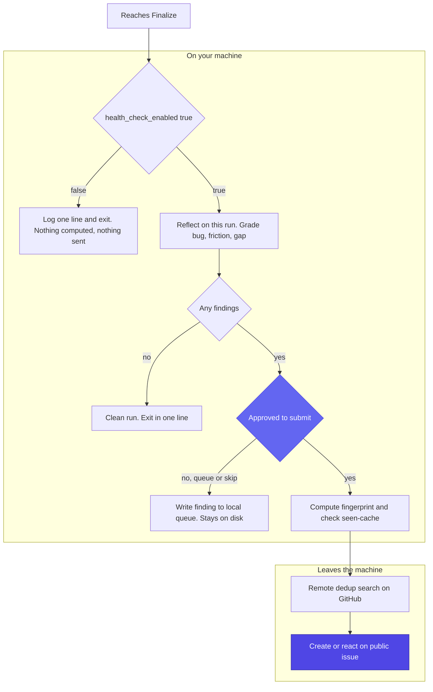

Every UltraCode Goal run that reaches Finalize ends with a health check: a brief self-improvement reflection that audits the run for friction, gaps, or bugs in *this module* and, when it finds something, offers to file a structured GitHub issue. The expected outcome is **zero findings** — a clean run exits in a line. This page covers exactly what it sends, the privacy model, how it dedups, and how to turn it off. The deterministic fingerprint and seen-cache plumbing is [`../skills/ultracode-goal/scripts/health_check_fp.py`](../skills/ultracode-goal/scripts/health_check_fp.py).

## What it is, and when it runs

The health check is a reflection step that runs **after every run that reaches Finalize** — a completed Epic, or one that ended in a story escalation. It does **not** run on an early block: a Stage 1 or Stage 2 stop never executed any of the module's run machinery, so there is nothing to audit. Findings are graded into three severities: `bug`, `friction`, and `gap`.

## Exactly what gets sent

A finding is a structured issue with a fixed set of fields plus an Environment table. The Environment table carries:

- Date
- OS
- AI Editor
- Model
- Profile (production / light)
- Run mode (attended / headless)
- Module Version

Explicitly **not** sent: no source code, no Epic content, no secrets. The evidence in a finding is `file:line` citations into **this module's own files** — the skill, its reference stages, and its scripts — never your project's code. A finding is a claim that *the module* could be better, backed by a pointer to the module file that proves it.

## Privacy

Issues are filed publicly on `armelhbobdad/bmad-module-ultracode-goal`. On an **attended** run nothing is sent silently: the health check always **HALTS at a `[Y]` / `[N]` / `[E]` gate** before submitting — yes to file, no to skip, edit to adjust first. You see the finding and approve it before it leaves your machine.

The boundary below shows the disable path, everything computed on your machine, and the two points where anything crosses to GitHub — both behind a gate:



The gate that admits anything to the right of the boundary is the `[Y]` approval on an attended run, or the autosubmit opt-in restricted to `bug`-severity findings on a headless run; the Environment table — never source code, Epic content, or secrets — is all that travels with a filed issue.

## Unattended behavior

Headless runs do not have a human at the gate, so by default they **queue findings locally and never live-submit**. Two config knobs (set in `{project-root}/_bmad/custom/ultracode-goal.toml`) change this:

- `health_check_enabled = false` — disables the health check entirely.
- `health_check_autosubmit = true` — opts **bug-severity** findings into live submission on unattended runs. `friction` and `gap` findings are **never** auto-submitted; they always queue regardless of this setting.

The local queue lives at the configured `health_check_queue_path` (by default `{project-root}/_bmad-output/ultracode-goal/improvement-queue/`); each finding is written one file per finding, named `hc-ultracode-goal-{stage}-{YYYYMMDD-HHmmss}.md`.

## Deduplication

Findings are deduped by a deterministic fingerprint so the same defect does not file twice. The fingerprint (`health_check_fp.py fingerprint`) is:

```
fp-XXXXXXX = "fp-" + sha1("{severity}|ultracode-goal/{stage}|"
                          "skills/ultracode-goal/references/{stage}.md|{section-slug}")[:7]
```

The `step_file` component is always the source-repo form `skills/ultracode-goal/references/{stage}.md` regardless of where the skill is installed, so the same defect dedups to the same key across a dev checkout and an installed `_bmad/` tree. `severity` is one of `bug`/`friction`/`gap`; `stage` is one of the six stage names (`ingest-and-scope`, `preflight`, `define-done`, `execute`, `gate`, `finalize`); `section-slug` is validated kebab-case.

Dedup runs at three levels:

1. **Machine-global seen-cache** at the configured `health_check_seen_cache` (by default `~/.ultracode-goal/health-check-seen.json`) — the `seen` / `record` subcommands check and atomically merge-write this cache (a missing, empty, or corrupt cache is treated as empty, never a crash). Each record carries the issue URL, the action taken (`created` / `reacted` / `commented` / `queued`), and the date.
2. **Remote search** — before filing, the existing issues are searched so a finding already filed by another machine is not duplicated.
3. **Server-side** — a repository Action closes duplicates and upvotes the canonical issue, so even a race between two machines converges on one issue.

## Submitting a queued finding manually

A queued finding sits as a body file under the queue directory. It carries YAML frontmatter (workflow, step_file, severity, fingerprint, date) followed by the same structured body the attended gate would have shown you, including the Environment table and the `file:line` evidence. Submit one when you are ready with:

```bash
gh issue create --repo <health-check-repo> --title "<title>" --body-file <path-to-queued-finding>
```

Nothing is sent until you run this command. You can also open one through the repository's issue chooser at <https://github.com/armelhbobdad/bmad-module-ultracode-goal/issues/new/choose>.
