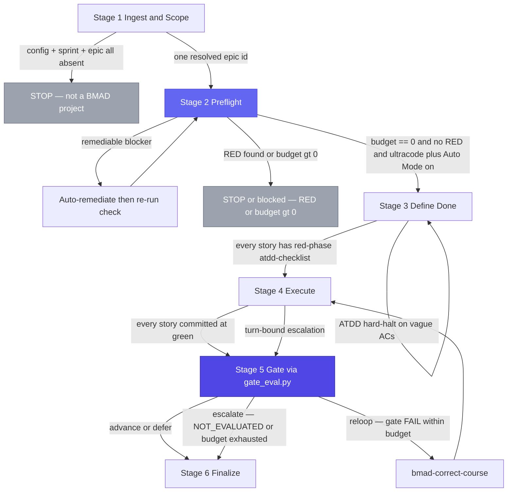
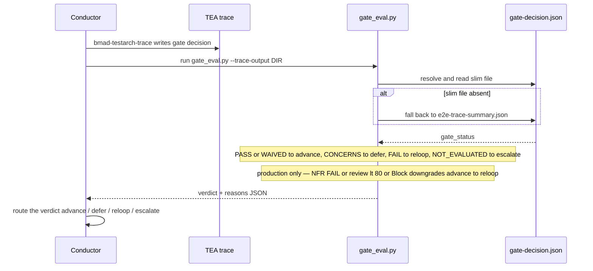

UltraCode Goal runs an Epic through six stages, in order. Each stage routes to the next by testable conditions stated in its reference file under [`../skills/ultracode-goal/references/`](../skills/ultracode-goal/references/). This page narrates the stages faithfully, the conditions that move between them, and the headless contract. For the design behind it, see [architecture](architecture.md); for the gate specifically, see the [gate model](gate-model.md).

## The six stages

| # | Stage | Routes by |
|---|-------|-----------|
| 1 | Ingest & Scope | one resolved Epic id, or stop |
| 2 | Preflight | post-remediation budget == 0 and no red, or stop |
| 3 | Define Done | every in-scope story has a red-phase atdd-checklist |
| 4 | Execute | every story committed at green, or a turn-bound escalation |
| 5 | Gate | the `gate_eval.py` verdict: advance / defer / reloop / escalate |
| 6 | Finalize | terminal — report, ledger, memory capture |

The stages run in order, but the edges are conditional — each one only advances on a testable condition, and two of them loop backward on failure. This shows the real routing, including the preflight remediation loop and the gate re-loop:



A `defer` verdict appends non-blocking items to the ledger and advances anyway; an `escalate` ends the run as `blocked` at Stage 6 rather than `complete`. The reloop edge re-runs the story only while turn and token budget remain — once exhausted, a FAIL becomes an escalate.

### Stage 1 — Ingest & Scope

Resolve **which** Epic this run delivers and lock the profile. The operator names the Epic (or the skill picks the obvious in-flight one from `sprint-status.yaml`); the skill locates the Epic/story files, the PRD, and the ADR/architecture, and records the paths to the run's `.decision-log.md`. This is the cheap stage that prevents an expensive run from targeting the wrong Epic.

The one absence that hard-stops here: if `_bmad/` config **and** `sprint-status.yaml` **and** any Epic are *all* absent, this is not a BMAD project — the skill points at `bmad-bmb-setup` and `bmad-sprint-planning` and stops. A title-only Epic with no stories does **not** stop here (Stage 2 generates the missing stories); an Epic whose stories are all already `done` triggers an "already complete — re-run anyway?" check. If the Epic cannot be resolved to exactly one id, the skill asks rather than guessing. See [`references/ingest-and-scope.md`](../skills/ultracode-goal/references/ingest-and-scope.md).

### Stage 2 — Preflight (the autonomy gate)

This is the load-bearing gate, because after it the run goes unattended. The posture is **hard gate with auto-remediation**:

1. **Mechanical check** — `preflight_check.py` parses tool versions, git state, and file existence and returns a `budget` count of mechanical blockers (test framework absent, dirty tree, on a protected branch, Claude Code below the minimum versions). It does **not** decide semantic intervention.
2. **Auto-remediation pass** — clear each remediable blocker, then re-run the check so `budget` reflects the fixes: scaffold the test framework (`bmad-testarch-framework`), scaffold the CI quality pipeline (`bmad-testarch-ci`, production only, strictly *after* the framework), generate missing acceptance criteria (`bmad-create-story`), pre-create the TEA output dirs, ensure exactly one `project-context.md`, ensure `sprint-status.yaml` is present, force TEA **Create** mode, and prompt once (interactively) for any secrets.
3. **Semantic intervention scan** — the part the script cannot do: read the PRD and ADR for undecided product/architecture decisions, contradictions, acceptance criteria that presuppose an unmade decision, or a story whose "done" is undefinable. Any such item is **RED** and cannot be auto-remediated, because the fix is a human decision.

The run launches **only** when all hold: post-remediation `budget == 0`, the semantic scan found no RED, and ultracode session effort plus Auto Mode are on. Then the skill arms the environment — creates the Epic branch off `epic_branch_prefix`, merges the PreToolUse and Stop hooks into `.claude/settings.local.json` (asserting they are active, and injecting the resolved config into their env), and pre-populates the allowlist. On an attended run it prints the launch briefing and takes one soft confirm. See [`references/preflight.md`](../skills/ultracode-goal/references/preflight.md).

### Stage 3 — Define Done

Turn the Epic's acceptance criteria into **executable, red-phase acceptance tests** before any production code is written. Once per Epic, `bmad-testarch-test-design` (Epic-Level Mode) builds the risk-and-priority backbone: a risk matrix with scored, mitigated risks; P0–P3 priorities (the gate keys its thresholds to these); and NFR thresholds (unknowns are marked `UNKNOWN` and deferred, never guessed). Then, per in-scope story in sprint order: `bmad-create-story` sharpens the acceptance criteria, and `bmad-testarch-atdd` generates an `atdd-checklist-{story_key}.md` plus acceptance test files **every test marked `test.skip()`** (TDD red phase). ATDD hard-halts if a story's ACs are vague or the framework is missing — that is the signal to loop back to `bmad-create-story` for that story. Stage 3 is done only when every in-scope story has a story file with clear ACs and a generated atdd-checklist with red-phase tests on disk. See [`references/define-done.md`](../skills/ultracode-goal/references/define-done.md).

### Stage 4 — Execute

Drive each in-scope story from its red-phase tests to a green, committed state. The default is the **sequential `/goal` spine**; per story, in sprint order: set the current story (so the PreToolUse hook can find its marker) → `bmad-dev-story` implements the feature and un-skips the story's ATDD tests → run tests/lint/build and **print the raw output** as evidence → (production) `bmad-testarch-test-review` then `bmad-code-review` → commit at green (one commit per green story). The loop is wrapped in a single `/goal` whose condition encodes the per-story Definition-of-Done and carries the literal "…or stop after N turns" escape clause. The printed evidence keeps the run judgeable mid-flight, but **passing the `/goal` condition is not completion** — the authoritative verdict is Stage 5. The experimental `--parallel` path fans the same per-story loop out across worktree-isolated agents; see [parallel mode](parallel-mode.md). As the spine advances it overwrites a `run-status.json` heartbeat for pollers. See [`references/execute.md`](../skills/ultracode-goal/references/execute.md).

### Stage 5 — Gate

Decide whether a story (or, after the last story, the Epic) advances — by a deterministic artifact read. In production, the skill first backfills the evidence in order — `bmad-testarch-automate`, `bmad-testarch-trace` (which writes the gate decision), `bmad-testarch-nfr` — then runs `gate_eval.py`. The script reads TEA's `gate-decision.json` and returns a verdict the skill executes: `advance` (move to the next story), `defer` (append non-blocking items to the ledger and advance anyway), `reloop` (run `bmad-correct-course`, re-run the story within the remaining budget), or `escalate` (stop). The invariant: **a P0/critical FAIL never defers** — it re-loops within budget or escalates. See the [gate model](gate-model.md) and [`references/gate.md`](../skills/ultracode-goal/references/gate.md).

This is how the verdict is read deterministically — the conductor never grades the work itself, it runs the script and routes on what comes back:



The production AND fails closed: a missing or unparseable `nfr-assessment.md` or `test-review.md` is treated as a failing signal, so an otherwise-`advance` story downgrades to `reloop` rather than advancing on evidence the script could not read.

### Stage 6 — Finalize

Make the run pay off for the next one. Capture learnings deliberately — machine-local quirks to Auto Memory (`remember X`), team standards to the project's CLAUDE.md or `.claude/rules`. Optionally run the retrospective (`--retro`). Audit every `.decision-log.md` entry into the report, the addendum, or explicit process-noise. Produce a `run-report.md` (Epic, profile, per-story outcomes, the Epic-level gate, budget consumed, learnings, a pointer to the ledger), write the terminal `run-status.json`, surface this Epic's deferred-work ledger heading to the user, and fire the `on_epic_complete` hook **only** when the Epic actually advanced. See [`references/finalize.md`](../skills/ultracode-goal/references/finalize.md).

## Production vs. `--light`

The **production** profile wires the full TEA chain as gates: test-design, atdd, automate, test-review, nfr, trace, ci. **`--light`** downscopes to the trace gate only — Stage 5 skips automate/nfr/test-review backfill and runs only `bmad-testarch-trace`, then `gate_eval.py --profile light`, with no NFR/review AND. The profile is locked in Stage 1 and read (not re-derived) by Stages 3 and 5.

## The decision log

The run's `.decision-log.md` — held in the skill's run folder — is canonical memory. Compaction can drop everything else; the log recovers full state. It records scope, the preflight verdict, every gate outcome, every deferral, and (in headless) every assumption. **Resume** reads it: on a resumed run, Execute re-enters at the first story whose last logged gate verdict is not `advance`; advanced stories are not re-run, and the Epic branch, hooks, and allowlist are re-asserted (not rebuilt) before continuing.

## The run report and deferred-work ledger

At the end, two durable outputs sit beside the decision log. The **run report** (`run-report.md`) is the human takeaway. The **deferred-work ledger** (at `deferred_work_path`) holds one heading per Epic with a row per parked item — only non-gate-blocking work lands here (CONCERNS, non-critical findings, parked decisions); a P0/critical FAIL is never deferred. Finalize surfaces this run's Epic heading so nothing parked is invisible at handoff.

## Headless contract

With `-H`, the run is non-interactive: infer scope, default to production (unless `--light`), never prompt. Every exit point — a complete run at Stage 6, or an early block at Stage 1 (not a BMAD project / Epic unresolved / already complete), Stage 2 (preflight), or a Stage 6 story escalation — emits **one** object with all five keys always present, `null` when an artifact was not produced, and `reason` carrying a one-line cause only when blocked:

```json
{"status": "complete|blocked",
 "skill": "ultracode-goal",
 "decision_log": "<path to this run's .decision-log.md>",
 "report": "<path to run-report.md, or null>",
 "deferred_work": "<path to deferred-work.md, or null>",
 "reason": "<one line, present only when blocked>"}
```

An automator parses one schema regardless of where the run stopped; a blocked-before-report exit returns `report` and `deferred_work` as `null` rather than omitting them.
