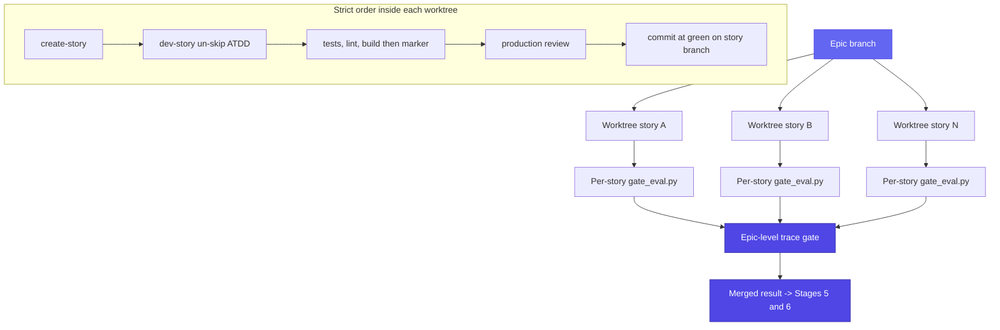

> **Experimental, opt-in.** `--parallel` is an additive execution path. The sequential `/goal` spine ([how it works](how-it-works.md), Stage 4) is the **default and recommended** path. Use `--parallel` only when you understand the known limits below, and expect to fall back to the spine.

When the operator passes `--parallel`, Stage 4 fans the Epic out across worktree-isolated per-story agents instead of driving them one at a time on the spine. This page covers what it does, how concurrency is bounded, and, honestly, where it is not yet validated. It is sourced from [`../skills/ultracode-goal/assets/execute-epic.workflow.js`](../skills/ultracode-goal/assets/execute-epic.workflow.js) and [`references/execute.md`](../skills/ultracode-goal/references/execute.md).

## What it does

`--parallel` invokes the saved dynamic workflow `execute-epic.workflow.js` (registered as `/ultracode-goal-execute`). Each in-scope story runs in its **own git worktree** on its own branch, so concurrent stories never overwrite each other's working tree. Within a worktree the steps are the same as the spine and strictly ordered: `bmad-create-story` (Create mode) → `bmad-dev-story` un-skipping the story's red-phase ATDD tests → run and print tests/lint/build, then write the tests-ran marker → (production) `bmad-testarch-test-review` then `bmad-code-review` → commit at green → per-story `gate_eval.py`. After every story lands, the workflow runs one epic-level trace gate and returns `{ perStory: [{story, verdict, gate_status}], epicGate, deferred: [...] }`, which feeds Stages 5 and 6.

The Epic branch is the trunk every story forks from, and the epic-level gate is where they converge:

Stories are batched to `parallel_max_concurrency` (default 8): each batch fans out in parallel, batches run sequentially, and a worktree commit on its own story branch is the per-story unit of work. The "merge back" is the epic-level trace gate consolidating the landed branches into one verdict object, not a mid-run interactive step, since the fan-out takes no input once launched.

Critically, this path **shares the sequential spine's truth sources**: the same `gate_eval.py` reading TEA's `gate-decision.json` (never the model, never the transcript-only `/goal` evaluator), and the same PreToolUse + Stop hooks merged at preflight enforce the invariants. The verdict mapping is owned by `gate_eval.py`; the spawned agents return its stdout fields verbatim and must not recompute TEA thresholds. See the [gate model](gate-model.md).

## Concurrency

The cap on simultaneous worktree agents is `parallel_max_concurrency`: **default 8** in `customize.toml`, chosen under the platform's 16-concurrent ceiling. Stories are batched: each concurrency-sized batch runs in parallel; batches run sequentially. The literal `4` inside the `.js` is only a fallback when the skill invokes the workflow without supplying `max_concurrency`; the governing value is the passed `parallel_max_concurrency`.

## No mid-run input

The fan-out takes **no interactive input once launched**: every gate and every blocker must be resolved at preflight or not at all. This is exactly why the [preflight](how-it-works.md) hard gate requires a post-remediation budget of zero before launch: there is no opportunity to answer a question mid-run, so a run that would have needed an answer must refuse to launch instead.

## Known limits: be honest

This path leans on workflow↔skill interplay the platform docs leave under-specified. Treat its behavior as empirically validated, not guaranteed:

- **Shared Auto Memory across worktrees.** All worktrees of one git repo share a single Auto Memory directory. There is no per-worktree isolation of learned facts. Concurrent writers can collide and interleave; expect interleaving rather than clean per-story memory.
- **Under-documented workflow↔skill interplay.** How args bind, and how the spawned subagents inherit the allowlist and the hooks, is not fully specified by the platform docs. The skill threads the resolved `skill_root` into the workflow args so the spawned agents get an absolute `gate_eval.py` path (the runtime has no `{skill-root}` resolver), but the broader handoff is treated as empirically validated, not guaranteed end to end.
- **No `run-status.json` heartbeat.** Worktree agents each see their own copy of `implementation_artifacts`, so this path cannot reliably write one shared snapshot: it does not write `run-status.json`. Watch progress via the workflow progress view (`/workflows`) and its run log instead; the launch briefing says so.

## Graceful degradation

If dynamic workflows are unavailable (wrong Claude Code version, the workflows feature off, or the saved command does not resolve), the skill **falls back to the sequential `/goal` spine** and logs a one-line note in `.decision-log.md` recording why `--parallel` degraded. The Epic still ships; it just ships sequentially. This is the safety net behind the recommendation to treat the spine as the default: choosing `--parallel` never risks the Epic, only the mode.

See [troubleshooting](troubleshooting.md) for what to check when `--parallel` does not behave, and [architecture](architecture.md) for how the workflow asset fits the conductor model.
