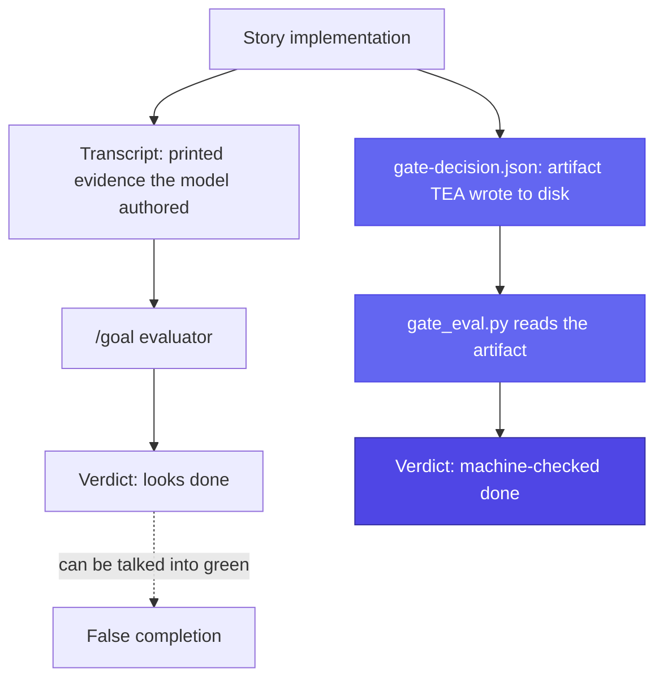
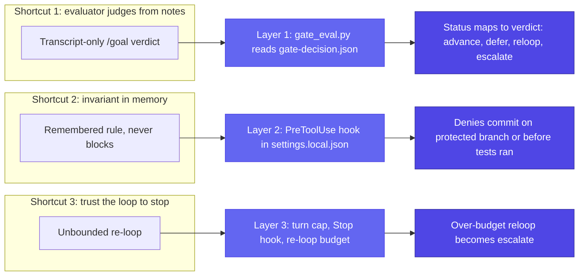

Autonomous coding agents have one failure mode that dwarfs the rest: a run that **looks** done and isn't. The agent reports green, the transcript reads clean, and the Epic ships with a P0 acceptance criterion silently unmet. UltraCode Goal exists to make that specific failure impossible — by deciding completion from a deterministic artifact a script reads, not from anything the model itself produces. This page explains the problem, the three enforcement layers that answer it, and when the module is the wrong tool.

## The problem

Three intuitive shortcuts all push an unattended Epic toward false completion, and each one is wrong for a documented mechanical reason.

**The evaluator only sees the transcript.** Claude Code's `/goal` mode drives a loop until a success condition is met, then asks an evaluator to confirm. But that evaluator reads the transcript — it cannot open a file on disk. It cannot read TEA's `gate-decision.json`. So if you let the `/goal` condition be the final word on "is this story done," you have asked the model to grade its own homework from its own notes. The model cannot be the judge of its own completion: the thing that decides "done" has to be something it cannot author.

The contrast is what the two judges read — the transcript-only evaluator versus the script that opens the artifact on disk:

**`/rewind` checkpoints miss Bash changes.** The obvious undo for a runaway agent is `/rewind`. But its checkpoints do not capture changes made through Bash — and an autonomous Epic run is mostly Bash: test commands, lint, build, and the git commits themselves. Rolling back to a checkpoint leaves the working tree's Bash-driven mutations in place. The real undo for this kind of run is git: an Epic branch off a protected branch, one commit per green story, worktree isolation. See the [gate model](gate-model.md) and [architecture](architecture.md) for how this is wired.

**Memory is context, not enforcement.** It is tempting to encode the run's invariants ("never commit on `main`", "never commit before tests pass") into Auto Memory or a CLAUDE.md rule and trust the model to honor them. But memory is context the model may or may not weigh — it does not *block* a `git commit`. An invariant that lives only in memory is a suggestion. An invariant that must hold has to live somewhere the model cannot talk its way past.

## The thesis: three enforcement layers

UltraCode Goal answers each shortcut with a layer the model cannot override.

**1. Deterministic gate truth.** Completion is decided by `scripts/gate_eval.py`, which reads TEA's `gate-decision.json` and maps its gate status to a routing verdict — `PASS`/`WAIVED` advance, `CONCERNS` defers, `FAIL` re-loops, `NOT_EVALUATED` escalates. The script never re-derives TEA's thresholds and never consults the transcript; it reads the artifact as given. The model produces evidence; the script reads the verdict. They are different things on purpose. See the [gate model](gate-model.md).

**2. Hooks as invariants.** The two invariants that must hold — no commit on a protected branch, no commit before a story's tests have actually run green — live in a **PreToolUse** hook, not in memory. The hook inspects each `git commit`/`git push` and denies it when the branch is protected or the story's tests-ran marker is absent. It is merged into `.claude/settings.local.json` at preflight and asserted active before the run goes unattended. A denied commit is enforcement; a remembered rule is not. See [architecture](architecture.md).

**3. Budget enforcement.** A runaway story is bounded two ways. The `/goal` condition carries a literal "…or stop after N turns" escape clause (the real in-loop bound, because a Stop hook cannot interrupt a `/goal` condition mid-turn), and a **Stop** hook tracks turns and tokens against `max_turns_per_story` / `story_token_budget`, writing an escalation marker when either is breached. The gate's re-loop budget is the third, deterministic bound: a `reloop` that would exceed the turn or token budget becomes an `escalate` instead. See [how it works](how-it-works.md).

Each layer answers one shortcut, and each lives somewhere the model cannot author or override:

These three are the module's non-negotiables. They exist because the documented mechanics make the intuitive shortcut wrong, so the skill does not optimize them away.

## When not to use it

UltraCode Goal is narrow on purpose. It is the wrong tool when:

- **There is no BMAD project.** It needs `_bmad/` config, a `sprint-status.yaml`, or an Epic to target. With none of the three present, Stage 1 hard-stops and points you at `bmad-bmb-setup` and `bmad-sprint-planning`. See [getting started](getting-started.md).
- **There are no Epics or stories.** The unit of delivery is one Epic with acceptance-bearing stories. There is nothing for the gate to read against a loose task list.
- **The work is exploratory.** If the Definition-of-Done is genuinely undecided — open product or architecture questions, "TBD" on a load-bearing requirement — preflight refuses to launch rather than let an unattended run guess. That refusal is correct; resolve the decisions first, then run.
- **You want interactive pairing.** The whole point is that the human leaves the loop after preflight. If you want to review each step, drive the underlying BMAD skills (`bmad-dev-story`, `bmad-code-review`, the TEA workflows) directly instead.
